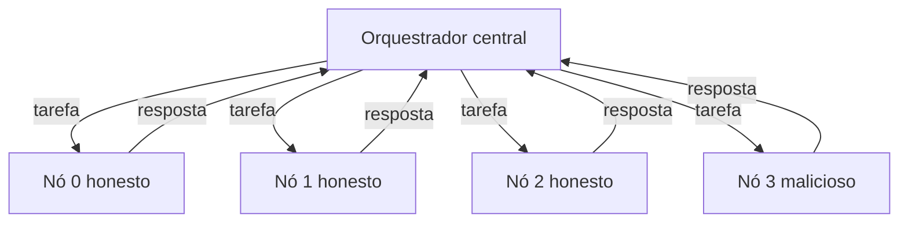
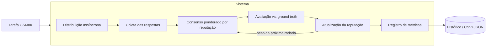

# Sistema — Rede Distribuída de Inferência com Reputação

Implementação da versão inicial do TCC: um **orquestrador central fixo** distribui
tarefas a **nós em containers**, coleta as respostas de forma **assíncrona**, aplica
**consenso ponderado por reputação**, atualiza a **reputação dinâmica** dos nós e
registra **métricas** de cada rodada.

Esta primeira versão segue as decisões da reunião de orientação (20/08): começar
simples, com orquestrador fixo em rede bem conectada, para obter rapidamente um
sistema mínimo funcional.

## Mapa das decisões → implementação

| Decisão da reunião | Onde está |
| --- | --- |
| Orquestrador fixo, rede bem conectada (estrela) | [orchestrator/run.py](sistema/orchestrator/run.py) |
| Comunicação assíncrona | `httpx` + `asyncio.gather` (orquestrador) e FastAPI (nós) |
| Nós honestos / maliciosos / instáveis | [core/behavior.py](sistema/core/behavior.py), [node/app.py](sistema/node/app.py) |
| Reputação dinâmica atualizada por rodada | [core/reputation.py](sistema/core/reputation.py) |
| Consenso (ponderado vs. maioria) | [core/consensus.py](sistema/core/consensus.py) |
| Dataset GSM8K (+ amostra offline) | [core/dataset.py](sistema/core/dataset.py) |
| Modelo pequeno (SmolLM3-3B) | [node/inference.py](sistema/node/inference.py), [scripts/test_model.py](sistema/scripts/test_model.py) |
| Ground truth só no orquestrador | tarefas em modo `real` não enviam `expected` |
| Métricas (acurácia, consenso, tempo, reputação) | [core/metrics.py](sistema/core/metrics.py) |

## Estrutura

```
sistema/
├── core/            # lógica compartilhada (sem dependências externas)
│   ├── reputation.py    # EMA da reputação
│   ├── consensus.py     # consenso ponderado e por maioria
│   ├── behavior.py      # perfis honest/malicious/unstable (simulação)
│   ├── dataset.py       # GSM8K + amostra offline
│   ├── answer.py        # extração da resposta numérica
│   ├── metrics.py       # registro CSV/JSON
│   └── data/gsm8k_sample.json
├── simulate.py      # simulação local (sem Docker, sem modelo)
├── node/            # servidor FastAPI do nó + inferência
├── orchestrator/    # orquestrador assíncrono
├── scripts/         # gerador de compose e teste de modelo
└── config/experiment.yaml
```

## Uso rápido

### 1) Simulação local (sem instalar nada)

Valida reputação, consenso e métricas em segundos, usando só a biblioteca padrão:

```bash
python -m sistema.simulate --nodes 4 --malicious 0.25 --rounds 20
```

Cenário difícil (50% maliciosos em conluio) — mostra a vantagem da reputação:

```bash
python -m sistema.simulate --nodes 4 --malicious 0.5 --collusion-value 999 --rounds 20
```

### 2) Rede em containers (comunicação assíncrona)

```bash
docker compose up --build
```

Sobe 4 nós (3 honestos + 1 malicioso) e o orquestrador, que roda o experimento e
grava as métricas em `sistema/results/`. Modo `mock` por padrão (sem modelo).

Escalar para mais nós (ex.: 10 nós, 25% maliciosos):

```bash
python -m sistema.scripts.gen_compose --nodes 10 --malicious 0.25
docker compose -f docker-compose.generated.yml up --build
```

### 3) Testar o modelo no GSM8K

```bash
pip install -r sistema/requirements-model.txt
python -m sistema.scripts.test_model --model HuggingFaceTB/SmolLM3-3B --dataset gsm8k --num-samples 20
```

## Mecanismo de reputação

Cada nó começa com reputação `0.5`, atualizada a cada rodada por média móvel
exponencial:

$$r \leftarrow (1 - \alpha)\,r + \alpha\,s, \quad s = \begin{cases} 1 & \text{resposta correta} \\ 0 & \text{incorreta ou ausente} \end{cases}$$

O consenso ponderado soma a reputação dos nós que apontam cada resposta e escolhe
a de maior peso; a reputação da rodada anterior é usada como peso da rodada atual.

## Métricas geradas (`sistema/results/`)

- `per_node.csv` — resposta, acerto, latência e reputação (antes/depois) por nó e rodada.
- `rounds.csv` — consenso ponderado vs. maioria e acerto por rodada.
- `summary.json` — acurácia agregada, tempo médio e reputação final por perfil.

## Diagrama da rede



## Diagrama de avaliação



## Próximos passos

- Rodar `test_model` para medir a acurácia do SmolLM3-3B no GSM8K e o tempo por tarefa.
- Avaliar cenários (5/10/20 nós; 0/25/50% maliciosos) com `gen_compose`.
- Incluir nós instáveis (`--unstable`) e analisar o efeito da latência.
- Migrar de `mock` para `real` (inferência com LLM) quando o hardware permitir.
