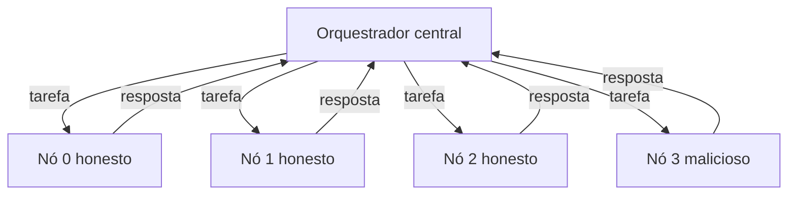
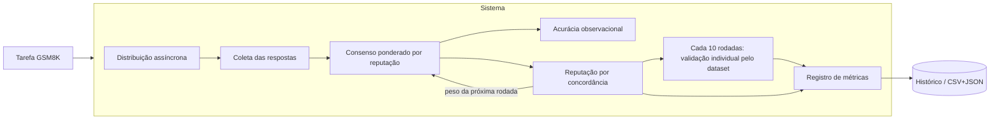

# Sistema — Rede Distribuída de Inferência com Reputação

Implementação da versão inicial do TCC: um **orquestrador central fixo** distribui
tarefas a **nós em containers**, coleta as respostas de forma **assíncrona**, aplica
**consenso ponderado por reputação**, atualiza a **reputação dinâmica** dos nós e
registra **métricas** de cada rodada.

Esta primeira versão segue as decisões da reunião de orientação (20/08): começar
simples, com orquestrador fixo em rede bem conectada, para obter rapidamente um
sistema mínimo funcional.

## Mapa das decisões → implementação

| Decisão da reunião | Onde está |
| --- | --- |
| Orquestrador fixo, rede bem conectada (estrela) | [orchestrator/run.py](sistema/orchestrator/run.py) |
| Comunicação assíncrona | `httpx` + `asyncio.gather` (orquestrador) e FastAPI (nós) |
| Nós honestos / maliciosos / instáveis | [core/behavior.py](sistema/core/behavior.py), [node/app.py](sistema/node/app.py) |
| Reputação dinâmica atualizada por rodada | [core/reputation.py](sistema/core/reputation.py) |
| Consenso (ponderado vs. maioria) | [core/consensus.py](sistema/core/consensus.py) |
| Dataset GSM8K (+ amostra offline) | [core/dataset.py](sistema/core/dataset.py) |
| Modelo pequeno (SmolLM3-3B) | [node/inference.py](sistema/node/inference.py), [scripts/test_model.py](sistema/scripts/test_model.py) |
| Gabarito restrito ao avaliador | nenhum pedido HTTP envia `expected`; mock usa fixtures locais |
| Métricas (acurácia, consenso, tempo, reputação) | [core/metrics.py](sistema/core/metrics.py) |

## Estrutura

```
sistema/
├── core/            # lógica compartilhada (sem dependências externas)
│   ├── reputation.py    # EMA da reputação
│   ├── consensus.py     # consenso ponderado e por maioria
│   ├── behavior.py      # perfis honest/malicious/unstable (simulação)
│   ├── dataset.py       # GSM8K + amostra offline
│   ├── answer.py        # extração da resposta numérica
│   ├── metrics.py       # registro CSV/JSON
│   └── data/gsm8k_sample.json
├── simulate.py      # simulação local (sem Docker, sem modelo)
├── node/            # servidor FastAPI do nó + inferência
├── orchestrator/    # orquestrador assíncrono
├── scripts/         # gerador de compose e teste de modelo
└── config/experiment.yaml
```

## Uso rápido

### 1) Simulação local (sem instalar nada)

Valida reputação, consenso e métricas em segundos, usando só a biblioteca padrão:

```bash
python -m sistema.simulate --nodes 4 --malicious 0.25 --rounds 20
```

Cenário difícil (50% maliciosos em conluio) para comparar os métodos:

```bash
python -m sistema.simulate --nodes 4 --malicious 0.5 --collusion-value 999 --rounds 20
```

### 2) Rede em containers (comunicação assíncrona)

```bash
docker compose up --build
```

Sobe 4 nós (3 honestos + 1 malicioso) e o orquestrador, que roda o experimento e
grava as métricas em `sistema/results/`. Modo `mock` por padrão (sem modelo).

Escalar para mais nós (ex.: 10 nós, 25% maliciosos):

```bash
python -m sistema.scripts.gen_compose --nodes 10 --malicious 0.25
docker compose -f docker-compose.generated.yml up --build
```

### 3) Testar o modelo no GSM8K

```bash
pip install -r sistema/requirements-model.txt
python -m sistema.scripts.test_model --model HuggingFaceTB/SmolLM3-3B --dataset gsm8k --num-samples 20
```

## Mecanismo de reputação

Cada nó começa com reputação `0.5`. Há três mecanismos: EMA, EMA assimétrica e
Beta. Nas tarefas normais, o sinal vem da concordância com o consenso calculado
usando os pesos anteriores. Concordância vale 1, divergência e ausência valem 0;
empate ou confiança abaixo de `min_confidence=0.55` mantém o peso dos respondentes.
O gabarito dessas tarefas serve somente à medição de acurácia, sem alterar pesos.

Na EMA: `r <- (1 - alpha) * r + alpha * sinal`. Na validação, o sinal vem do
acerto individual contra a resposta reservada do dataset. Erro HTTP e resposta
inválida mantêm a reputação; timeouts consecutivos podem receber penalidade
configurável e são registrados separadamente.

O consenso ponderado soma a reputação dos nós que apontam cada resposta e escolhe
a de maior peso; a reputação da rodada anterior é usada como peso da rodada atual.

## Rodadas de teste

A avaliação usa o mesmo calendário em todos os experimentos: **uma rodada de
teste a cada 10 rodadas** (rodadas 10, 20, 30, 40 e 50, em numeração a partir
de 1). Depois da tarefa normal dessas rodadas, todos os nós recebem perguntas
de validação, por padrão duas. O avaliador compara respostas individuais com o
dataset, sem consenso, e atualiza o mesmo estado de reputação. O novo peso só
afeta a próxima tarefa. Não há parâmetro `--ground-truth`.

Cada teste é registrado em `rounds.csv` (`is_test=1`, coluna `test_round`) e
no `summary.json` (`test_rounds` e `consensus_accuracy_*_on_tests`). Essas
marcações medem o consenso ANTES da validação. As validações efetivamente
concluídas ficam em `summary.validation_rounds` e determinam as linhas verticais
dos gráficos novos. `--no-validation` permite uma execução de controle.

O dataset é particionado por semente: tarefas normais e perguntas reservadas
não se sobrepõem. Fonte, hash do conteúdo e IDs ficam em `summary.json` e
`manifest.json`. A seleção usa um gerador aleatório separado das respostas.
`sample` contém dez problemas offline para verificar o fluxo; `--dataset gsm8k`
usa o split `test` (requer as dependências de modelo). O projeto não treina a LLM
nem comprova que esse dataset fez parte de seu treinamento.

Exemplo de integração e exportação, executado a partir da raiz:

```bash
python -m sistema.simulate --nodes 20 --rounds 50 --test-every 10 --validation-questions 2 --output sistema/results/validacao_nova
python -m sistema.scripts.run_matrix --nodes 20 --seeds 2 --output sistema/results/matriz_validacao_nova
python -m sistema.scripts.export_validacao sistema/results/matriz_validacao_nova sistema/resultados/validacao_nova
python -m unittest discover -s sistema/tests -v
```

A exportação preserva cores, marcadores e transparência dos templates da main,
gera figuras que leem diretamente os CSVs e usa reputações após a validação.
O relatório separa a acurácia do consenso da acurácia individual de validação.
Use uma pasta de saída nova: resultados de validação existentes são protegidos
inclusive com `--overwrite`; retomada após interrupção não é suportada.

No YAML, configure `validation_enabled`, `validation_questions`,
`validation_pool_size`, `test_every` e os limites `audit_*`. A partição de
auditoria é fixa e independente da quantidade de perguntas por rodada. Se a
validação deve usar o split de treinamento GSM8K, configure `dataset: gsm8k` e
`dataset_split: train`; a origem do split fica no manifesto. Isso mede respostas
a exemplos do treino e não substitui uma avaliação independente. A política
padrão aplica uma penalidade a cada `audit_timeout_strikes` timeouts consecutivos; use
`audit_timeout_policy: hold` para desativá-la. Erros do avaliador e respostas
inválidas não são contados como falha do nó. Nós com falhas suficientes no bloco
de auditoria têm o peso efetivo limitado; o score operacional fica preservado e
sua recuperação é limitada por `recovery_cap`.

Para HTTP real, use `mode: real` e nós com
`INFERENCE_MODE=model`; para HTTP mock, use `dataset: sample`. O mock aceita apenas
as fixtures locais conhecidas e não representa inferência real.

## Métricas geradas (`sistema/results/`)

- `per_node.csv` — resposta, acerto, latência e reputação (antes/depois) por nó e rodada.
- `rounds.csv` — consenso ponderado vs. maioria e acerto por rodada.
- `summary.json` — acurácia agregada, tempo médio e reputação final por perfil.
- `reputation_history.csv` — checkpoint inicial e após cada rodada completa.
- `validation_audit_state.csv` — snapshots antes/depois da auditoria com score, peso efetivo, strikes, streaks e estado de bloqueio por nó.
- `validation_rounds.jsonl` — calendário, estado, duração e totais por validação.
- `validation_results.csv` — pergunta, nó, resposta, avaliação e reputações.
- `validation_updates.csv` — decomposição da atualização nos três mecanismos.
- `validation_history.csv` — histórico detalhado dos eventos de validação.

`validation_accuracy` exclui timeout/erro/inválido do denominador; consulte também
os totais e a cobertura em `validacao_por_execucao.csv`. Os resultados antigos
permanecem históricos e não demonstram o desempenho deste novo fluxo.

## Diagrama da rede



## Diagrama de avaliação



## Próximos passos

- Rodar `test_model` para medir a acurácia do SmolLM3-3B no GSM8K e o tempo por tarefa.
- Avaliar cenários (5/10/20 nós; 0/25/50% maliciosos) com `gen_compose`.
- Incluir nós instáveis (`--unstable`) e analisar o efeito da latência.
- Migrar de `mock` para `real` (inferência com LLM) quando o hardware permitir.
